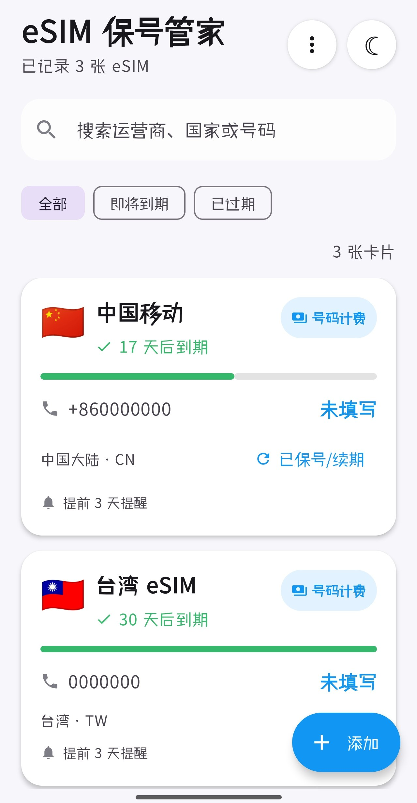
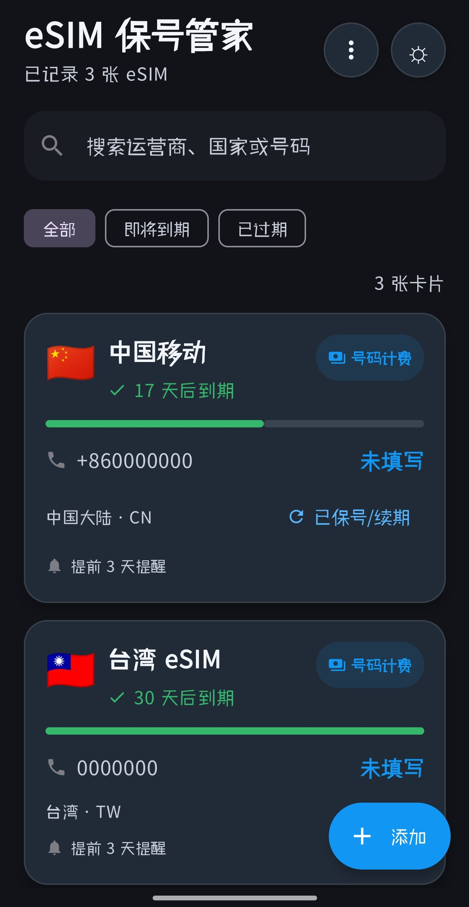
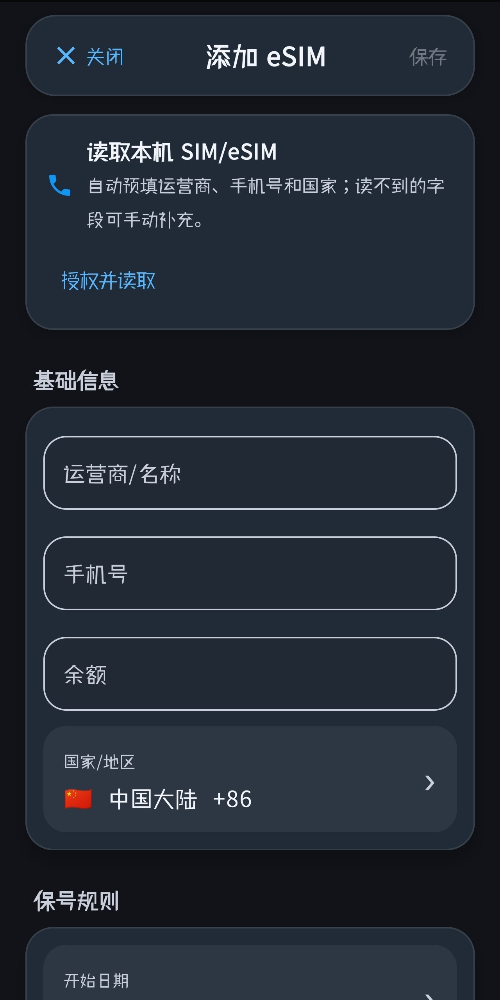
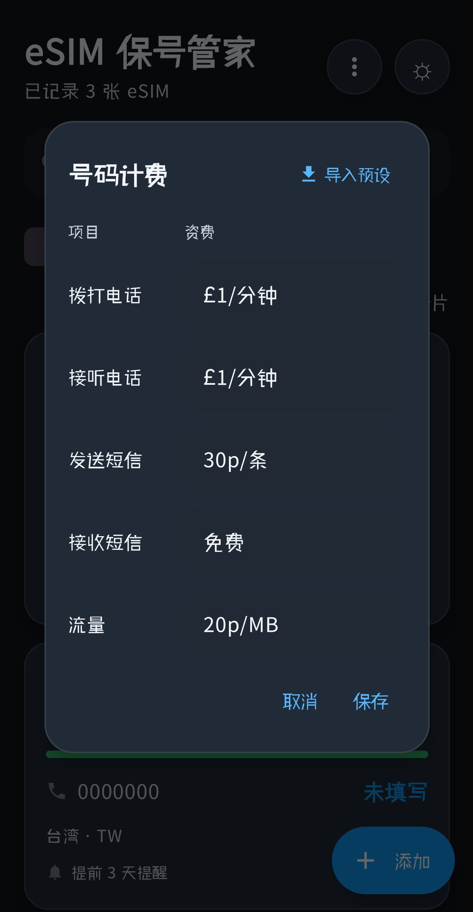

# eSIM Keeper / 保号助手

[English](README.md) | 简体中文

eSIM Keeper 是一个用于记录和管理海外手机号、eSIM、实体 SIM 卡保号信息的 Android App。它完全离线、不申请联网权限，所有数据都保存在本机。

## 适合谁使用

适合经常购买海外手机卡、旅行 eSIM、长期保号卡，或者需要记录不同号码资费规则的用户。如果你手里有好几张需要定期续费、容易忘记到期时间的号码，这个 App 可以帮你集中管理。

## 应用截图

  
  
  
  

  <em>卡片列表（浅色 / 深色） · 添加卡片 · 号码计费与导入预设</em>

## 主要功能

- 记录手机号、运营商、国家/地区、保号周期、到期日等信息
- 按周期或到期日计算保号状态，默认采用「按周期」
- 显示剩余天数和进度条，一眼看出还剩多少时间
- 支持号码计费记录，并内置 CTExcel、giffgaff 等资费预设
- 支持卡片排序（到期日 / 创建时间 / 名称）
- 支持数据备份导出与导入（JSON）
- 在系统日历中添加续费提醒，无需申请日历读写权限
- 支持深色模式
- 中英文界面
- 不申请 INTERNET 权限，数据只保存在本地

## 号码计费

每张卡片都可以记录自己的号码计费规则，包括：

- 拨打电话
- 接听电话
- 发送短信
- 接收短信
- 流量

资费内容由你自行填写，例如 `£1/min`、`30p/SMS`、`0.5p/MB`、`免费`、`不支持` 等。

为了少打字，号码计费弹窗右上角提供「导入预设」：选择国家（目前为中国）后，可一键导入常见卡的资费模板，目前内置：

- CTExcel
- giffgaff

导入后资费会自动填入当前卡片，你仍然可以继续手动修改并保存。后续计划继续加入更多国家、地区、运营商和旅行 eSIM 的资费预设。如果你有常用卡的资费信息，欢迎通过 Issue 或 Pull Request 提出建议。

## 隐私说明

本项目不会上传任何用户数据。App 不申请 `INTERNET` 权限，号码、资费、保号规则等信息默认只保存在本机的本地数据库中。

仅在你主动导入本机 SIM/eSIM 信息时，App 才会请求以下权限：

- `READ_PHONE_STATE`：用于读取本机 SIM/eSIM 信息
- `READ_PHONE_NUMBERS`：当系统提供号码时用于读取本机号码

## 备份与导入

你可以将本地数据导出为 JSON 文件，也可以在换手机或重装 App 后重新导入恢复。号码计费等信息会一并随备份导出和导入。

建议定期备份自己的保号数据，避免忘记续费时间或丢失号码信息。

## 后续计划

- 增加更多号码计费预设（更多国家 / 地区 / 运营商 / 旅行 eSIM）
- 优化卡片展示和排序
- 增加更多国家/地区识别规则
- 优化备份与导入体验
- 根据用户反馈继续改进

## 反馈与贡献

如果你有任何想法、问题或建议，欢迎提交 Issue 或 Pull Request。

这个项目最初是为了解决我自己管理海外号码和保号规则时遇到的麻烦。如果你也有类似需求，希望它能帮到你。

## AI 辅助开发说明

本项目主要由 AI 辅助完成，我本人也在一边学习一边完善它。代码、设计和文案中可能还有不成熟的地方，欢迎大家提出建议，也请多多包涵。

## 免责声明

灵感来自 SIMHUB。本 App 是一个独立项目，并非官方产品，与 SIMHUB 无任何隶属、认可或赞助关系。
